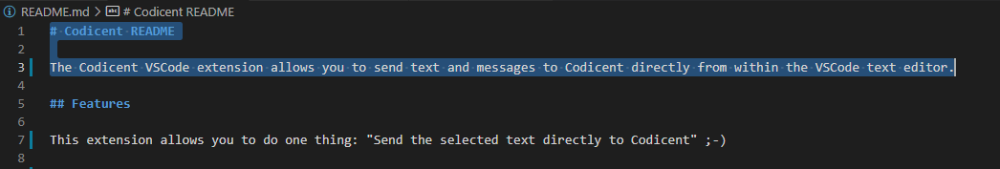
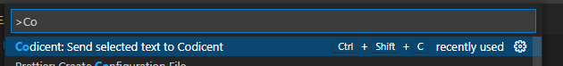
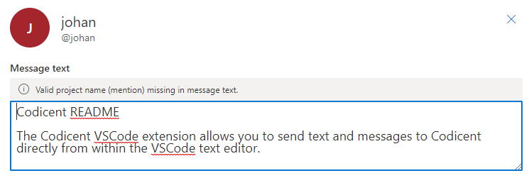

# Codicent README

The Codicent VSCode extension allows you to send text and messages to Codicent directly from within the VSCode text editor.

## Features

This extension allows you to do one thing: "Send the selected text directly to Codicent" ;-)

## How to use

1. Select the text you want to send to Codicent.

   

2. Press `CTRL+SHIFT+C` (macOS: SHIFT+CMD+C) or select **Codicent: Send selected text to Codicent** on VSCode Command Palette (`CTR+SHIFT+P`).

   

3. The Codicent compose window is opened with the selected text.

   

## Requirements

A codicent account is required for this extension (https://codicent.com).

## Known Issues

None

## Release Notes

Users appreciate release notes as you update your extension.

### 1.0.0

Initial release of the Codicent extension. One feature => send selected text to Codicent.

### 1.0.1

Bugfix: some text segments were not copied correctly to Codicent (e.g. texts including the character #).

### 1.0.2

Codicent MCP Server support and device authentication flow implemented.

### 1.0.3

Improved Codicent auth flow.
 